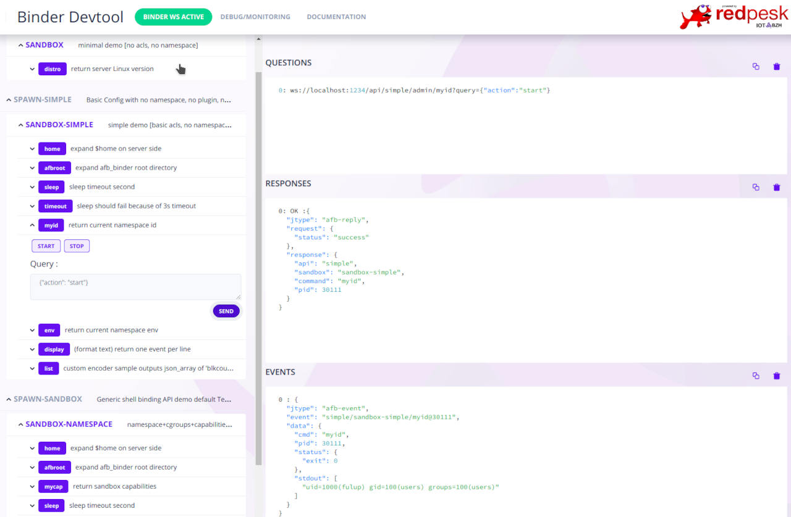

# Spawn Binding

spawn-binding exposes through a standard set of REST/Websocket APIs a simple mechanism to launch within secure sandbox containers your preferred Linux native commands or scripts: bash, python, node, ruby ...
Sandbox security model scales from simple Linux access control to advanced mechanism as capabilities, cgroups, namespaces, ...

**Developer and user documentation at [redpesk-docs](http://docs.redpesk.bzh/docs/en/master/apis-services/spawn-binding/spawn_binding_doc.html)**

## Based on AFB V4 micro-service architecture

spawn-binding can be used in standalone to provide a simple secure HTML5 interface to your preferred scripts. When used in conjunction with AFB framework its also leverage SeLinux/Smack to check API access with Cynara.

