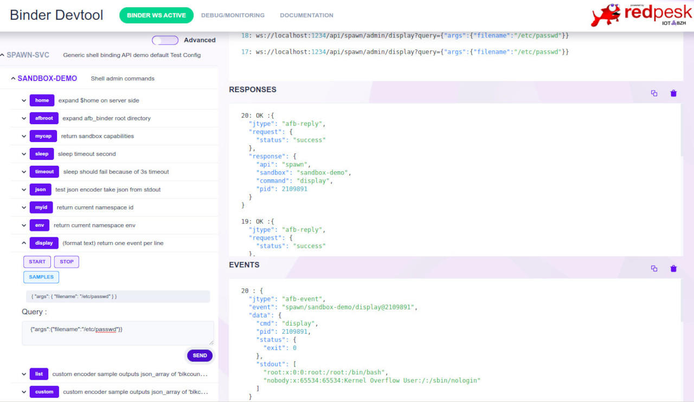

# Architecture presentation

spawn-binding exposes through a standard set of REST/Websocket APIs a simple mechanism to launch within secure sandbox containers any Linux native commands or script: bash, python, nodejs, lua, tcl, ...

spawn-binding can launch any Linux executable command that supports a non-interactive mode. Its security model scales from basic Linux access control with setuid/gid to advanced Linux security model based on cgroups, capabilities, seccomp and namespaces. Output generated during children execution on stdout/stderr are sent back to the client through standard websocket as AFB events.

spawn-binding was initially designed to provide a user interface to the 'redpesk' factory-reset service, which then enables end-users to easily restore their system when things get really bad (SOTA failure, hardware breakdown, ...). Nevertheless its implementation is very generic, and it may respond to many other scenarios requirements:

* any operation where a controlled upscale of user privileges is required (enter sleep-mode, reboot, reformat a disk, on-demand service activation, ...),
* expose any (bash, python, nodejs, ...) script as AFB standard microservices (with privileges upscale or not),
* autostart operation before systemd is ready (see vpn-autostart sample)
* out-of-the-box exposure through websocket of any set of scripts/commands
* ...

Spawn-binding only requires a custom config.json to expose a new set of scripts/commands. It is not needed to change/recompile the source code to create a specific API or tune the security model to match your requirements.

* Define a config.json with 'script' commands you wish to expose
* User standard afb-devtools-ui or provide a custom HTML5 page.

*Notes:*

* developers who never had the opportunity to dig seriously into Linux advanced security model (cgroups, capabilities, namespace, seccomp, ...) may find usefully to run basic Linux commands/scripts with different security scenarios to check the effective impact of container sandbox settings on their own applications.
* performance cost: isolating the amount of extra resources due to spawn-binding sandbox containerization is not a simple task. Nevertheless previous experiments IoT.bzh did show that processing sandboxes configurations usually cost more than the effective launch of the container itself. In order to reduce config processing, spawn-binding compiles configurations at startup time, as a result outside of dynamic argument processing the extra cost should remains around 10ms on a typical embedded board as Renesas-M3/H3.

## Documentation

* [Installation Guide](./2-installation_guide.html)
* [Configuration](./3-configuration.html)
* [Running and Testing](./4-running_and_testing.html)

## Support/sources

Spawn-binding is part of redpesk-common and relies on [redpesk-core]()

* Community support [#redpesk-core:matrix.org]( )
* source code: [github/redpesk-common](https://github.com/redpesk-common)

## HTML5 test page

