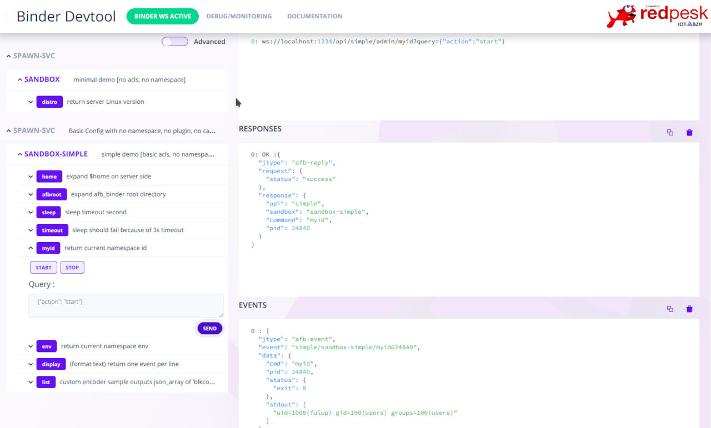

# Running/Testing

When in the need of a quick feedback loop, the config file should be
used as shown below. For production, the resource binding system should
be used: the spawn-binding is installed as a resource binding which
cannot be launched on its own; another binding, which is launch-able by
the framework facilities, provides a configuration to the spawn-binding.
See [more details about resource bindings here]().

## Requirements

* you should have a valid afb-binder install.
* you should write or copy a sample spawn-config.json (see in [spawn-binding's repo](https://github.com/redpesk-common/spawn-binding/tree/master/etc)
* you should known the path to `spawn-binding.so`
* you need a test client
  * afb-client as a command line interface
  * afb-ui-devtools as a graphical user interface (web app, test with a browser)

## Run spawn-binding samples

```bash
afb-binder --binding=/usr/redpesk/spawn-binding/lib/spawn-binding.so:./spawn-basic-config.json -vvv
```

> Note: --binding should point to where your *spawn-binding.so* is installed, the path after `:` should point to a valid JSON config

Depending on what commands you are trying to run and with which
containerization options, you may need to add `sudo` before the command
so that the binding has the necessary privileges.

## HTML5 test

Open binding UI with browser at `[host]:[port]/devtools/index.html` in your browser address bar.
*For example: [localhost:1234/devtools/index.html](http://localhost:1234/devtools/index.html) for a binding running on localhost, on port 1234.*

You should see a page as the one below fitting your configuration. To activate a command simply click, select a sample and sent.


## Command line test

[afb-client documentation]()

### Connect *afb-client* to spawn-binding service

``` bash
afb-client --human ws://localhost:1234/api
```

>Note: depending on afb-client version you may have no prompt. Use `simple ping` to assert spawn binding is alive !!!

### Basic commands

```bash
spawn admin/myid
spawn admin/env
spawn admin/cap
```

**spawn** is what ever *api name* your have chosen in your config.json. *Start* is the default action, also *spawn admin/myid* is equivalent to *spawn admin/myid {"action":"start"}*.

### Passing arguments from query to CLI

Api query takes args from the client as a json-object compose of {"name":"value"} tuples.

```bash
spawn admin/list {"args":{"dirname":"/etc"}}
spawn admin/list {"args":{"dirname":"/home"}}
spawn admin/display {"args":{"filename":"/etc/passwd"}}
```

Each argument passed into query *args* replaces corresponding %name% in binding config.json. In following example json query argument {"timeout": value} is passed to sleep command.

```json
config: "exec": {"cmdpath": "/bin/sleep", "args": ["%timeout%"]}
query:  {"action":"start","args":{"timeout":"180"}}
start:  sleep 180;

```

* mandatory argument: %argument% (abort the request when missing)
* optional argument: ?argument? (silently replaced by "" when missing)

## Advanced tests

Check for conf.d/project/etc for more advance samples.

Note: depending if you start spawn-binding in a privilege mode or not, some behavior may change. For example "user/group" or "capacity" required to start the binder in admin mode with sudo.

```log
- NOTICE: [API spawn] sandboxParseAcls: [ignoring user/group acls] sandbox='sandbox-demo' no uid/gid privileges ignoring user='"daemon"' group='"dialout"' [/home/fulup/spawn-binding/src/- spawn-sandbox.c:510,sandboxParseAcls]
- NOTICE: [API spawn] [capability ignored] sandbox='sandbox-demo' capability='KILL[set]' (sandboxParseOneCap)
- NOTICE: [API spawn] [cgroups ignored] sandbox=sandbox-demo user=1000 not privileged (sandboxLoadOne)
```

**Warning** if you load multiple file double-check that they register different APIs name. Your HTML5 interface should reflect


## Testing with GDB

When testing with GDB you should add *--trap-faults=no* in order to prevent afb-binder from trapping errors.

```bash
gdb --args afb-binder --binding=/usr/redpesk/spawn-binding/lib/spawn-binding.so:./spawn-basic-config.json -vvv --trap-faults=no
```

## Testing namespace

Namespace allows to create a *fake* root filesystem that only expose the minimal necessary resources. Unfortunately depending on your restriction the process may not even start, with no-log to help debugging the situation.

For a quick namespace test, start spawn-binding with *spawn-sample-nspace.json*. Then use *spawn/admin list* api/verb to explore your namespace.

```bash
afb-binder --binding=/usr/redpesk/spawn-binding/lib/spawn-binding.so:./etc/spawn-sample-nspace.json -vvv
```

Namespace can a tricky to debug. In case of doubt add `{"verbose":1}` to query argument list, this will push within your command stderr the bwrap equivalent command. You may then copy/paste the command line and replace you command with "bash" to explore in interactive mode your namespace.

## Testing formatting

spawn-binding support 3 builtin formatting options. Encoder formatting is enforced for each command within config.json. Default encoder is "DOCUMENT" and it cannot not be change at query time. Check *spawn-sample-encoders.json* for example. If you need the same command with multiple formatting, then your config should duplicate the entry with different uid.

## Exposing spawn API as AFB micro-service

In order to make spawn-binding api accessible from other AFB micro-service you simply export the API with *--ws-server=unix:/path/apiname* as you would do for any other AFB micro-service. The exposed API may later be imported with *--ws-client==unix:/path/apiname* by any afb-binder that get corresponding privileges. *Note: when exposing an API locally it is a good practice to remove TCP/IP visibility with --no-httpd*

```bash
# note than --ws-server=unix exported API should match with selected config.json
afb-binder --binding=/usr/redpesk/spawn-binding/lib/spawn-binding.so:./etc/spawn-simple-config.json -vvv --no-httpd --ws-server=unix:/run/user/$UID/simple
```

Direct unix socket API can be tested with *--direct* argument

``` bash
# note that when using direct api, apiname should not be added to the request
afb-client --direct unix:/run/user/$UID/simple
> ping
> admin/env
```

## Autoload/Autostart

spawn-binding supports an 'autoload', any action in this sections will be tried at binding starup time.

```json
  "onload": [
    {
      "uid": "vpn-autostart",
      "info": "create VPN interface (reference https://www.wireguard.com/quickstart)",
      "action": "api://autostart#vpn-start"
    }
  ],
```

*wireguard-autostart.json* provide a small example to start a wireguard VPN.

To run the test.

* Install 'wireguard-tools' to get 'wg-quick' helper.
* Start 'wireguard-autoconfig.sh' to create a test config into /etc/wireguard/spawn-binding.conf
* Check with ```sudo wg-quick up spawn-binding``` that your config works.
* Start 'spawn-binding' in privileged mode with

```bash
sudo AFB_SPAWN_CONFIG=../conf.d/project/etc/wireguard-autostart.json afb-binder --name=afb-spawn --binding=package/lib/afb-spawn.so --verbose
```

## caching events

spawn-binding is an [afb-controller](/docs/en/master/developer-guides/controllerConfig.html) and may on event reception execute internal/external API. For external action you should use *--ws-client=xxx* to import the api within spawn-binding context. Note that to execute an external API you also need corresponding privileges.

```json
  "events": [
    {
      "uid": "monitor/disconnected",
      "info": "call log function on monitor/disconnect event detection",
      "action": "api://autostart#vpn-log"
    }
  ],
```
