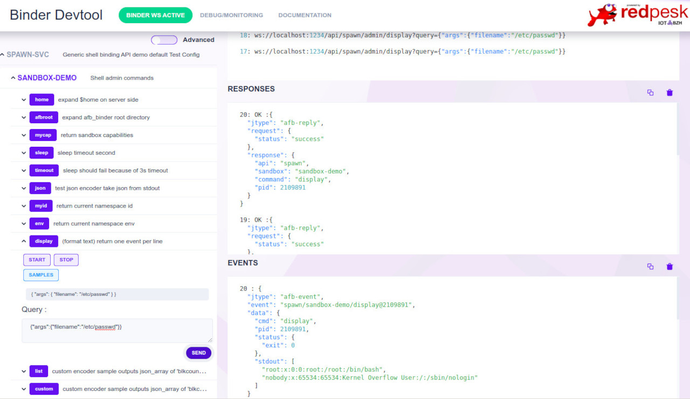

## Running/Testing

Spawn-binding implements *afb-libcontroller* and requires a valid afb-controller-config.json to operate. For testing purpose the simplest way
is to define ```AFB_SPAWN_CONFIG``` environnement variable with a full or relative path to binder *rootdir*.

### Requirements

* you should have a valid afb-binder install.
* you should write or copie a sample spawn-config.json
* you should known the path to 'afb-spawn.so' binding
* you need a test client
    * afb-client for testing command line interface
    * afb-ui-devtools for html5 test with a web-browser (chomium, firefox, ...)

If you run redpesk simply install the package with ```dnf install spawn-binding``` for other platform check redpesk [developer guide](https://docs.redpesk.bzh/docs/en/master/developer-guides/host-configuration/docs/1-Setup-your-build-host.html)

## Selection and verify your config
``` bash
export AFB_SPAWN_CONFIG=/path-samples-config/spawn-sandbox-config.json
```

## Verify json config validity
``` bash
jq < $AFB_SPAWN_CONFIG
```
*Note: JQ package should be available within your standard Linux repository*

## Start spawn-binding

``` bash
afb-binder --name=afb-spawn --binding=./package/lib/afb-spawn.so --verbose
```
*Note: --binding should point on where ever your *afb-spawn.so* is installed, and AFB_SPAWN_CONFIG should point on a valid json config*

## HTML5 test

Open binding UI with browser at `[host]:[port]/devtools/index.html` in your browser address bar.
*For example: `localhost:1234/devtools/index.html` for a binding running on localhost, on port 1234.*

You should see a page as the one below fitting your configuration. To activate a command simply click, select a sample and sent.



## Command line test
## Connect *afb-client* to spawn-binding service
``` bash
afb-client --human ws://localhost:1234/api
```
***note:** depending on afb-client version you may have no prompt. Use ```spawn ping``` to assert spwan binding is alive !!!*

### Test your API with afb-client

#### Basic commands
```
spawn admin/myid
spawn admin/env
spawn admin/cap
```
**spawn** is what ever *api name* your have chosen in your config.json. *Start* is the default action, also *spawn admin/myid* is equivalent to *spawn admin/myid {"action":"start"}*.

#### Passing arguments from query to cli
Api query takes args from the client as a json-object compose of {"name":"value"} tuples.

```
spawn admin/list {"args":{"dirname":"/etc"}}
spawn admin/list {"args":{"dirname":"/home"}}
spawn admin/display {"args":{"filename":"/etc/passwd"}}
```
Each argument passed into query *args* replaces corresponding %name% in binding config.json. In following example json query argument {"timeout": value} is passed to sleep command.
```
config: "exec": {"cmdpath": "/bin/sleep", "args": ["%timeout%"]}
query:  {"action":"start","args":{"timeout":"180"}}
start:  sleep 180;

```
## Advanced tests
Check for conf.d/project/etc for more advance samples.

Note: depending if you start spawn-binding in a privilege mode or not, some behavior may change. For example "user/group" or "capacity" required to start the binder in admin mode with sudo.
```
- NOTICE: [API spawn] sandboxParseAcls: [ignoring user/group acls] sandbox='sandbox-demo' no uid/gid privileges ignoring user='"daemon"' group='"dialout"' [/home/fulup/spawn-binding/src/- spawn-sandbox.c:510,sandboxParseAcls]
- NOTICE: [API spawn] [capability ignored] sandbox='sandbox-demo' capability='KILL[set]' (sandboxParseOneCap)
- NOTICE: [API spawn] [cgroups ignored] sandbox=sandbox-demo user=1000 not privileged (sandboxLoadOne)
```

You may activate all config in one shot by using placing sample config name within AFB_SPAWN_CONFIG or by providing a suite of config.json filenames.
```bash
    SPAWN_SAMPLE_DIR=xxxxxx
    AFB_SPAWN_CONFIG= $SPAWN_SAMPLE_DIR
    AFB_SPAWN_CONFIG= $SPAWN_SAMPLE_DIR/spawn-simple-config.json:$SPAWN_SAMPLE_DIR/spawn-minimal-config.json

    afb-binder --name=afb-spawn --binding=xxxxxx/afb-spawn.so
```
**Warning** if you load multiple file double-check that they register different APIs name. Your HTML5 interface should reflect


## Testing namespace

Namespace allows to create a *fake* root filesystem that only expose the minimal necessary resources. Unfortunately depending on your restriction the process may not even start, with no-log to help debugging the situation.

For a quick namespace test, start spwan-binding with *spawn-sample-nspace.json*. Then use *spawn/admin list* api/verb to explore your namespace.
```
AFB_SPAWN_CONFIG=./conf.d/project/etc/spawn-sample-nspace.json afb-binder --name=afb-spawn --binding=./package/lib/afb-spawn.so
```
Namespace can a tricky to debug. In case of doubt add {"verbose":1} to query argument list, this will push within your command stderr the bwrap equivalent command. You may then copy/paste the command line and replace you command with "bash" to explore in interactive mode your namespace.

## Testing formatting

spawn-binding support 3 builtin formatting options. Encoder formatting is enforced for each command within config.json. Default encoder is "DOCUMENT" and it cannot not be change at query time. Check *spawn-sample-encoders.json* for example. If you need the same command with multiple formatting, then your config should duplicate the entry with different uid.